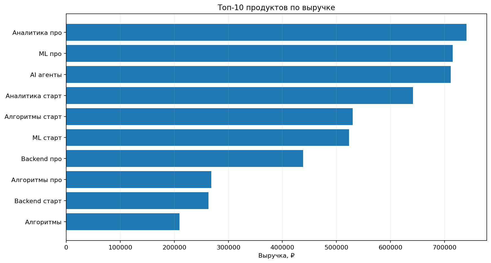
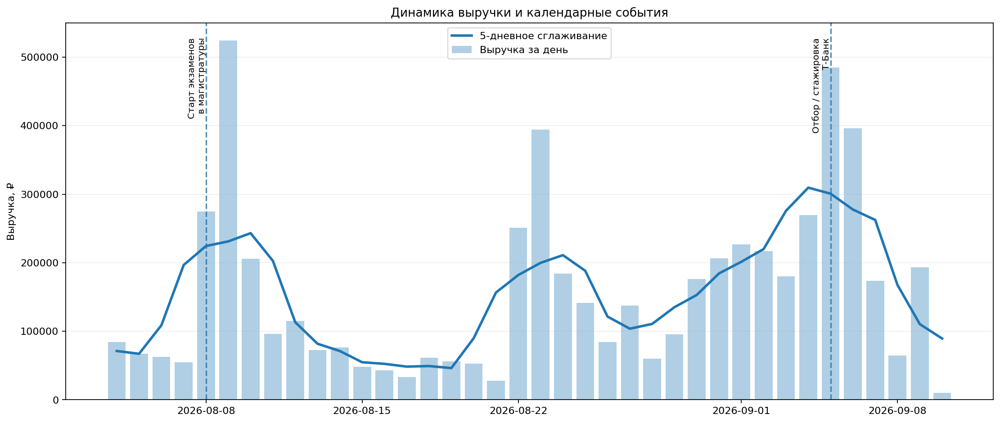
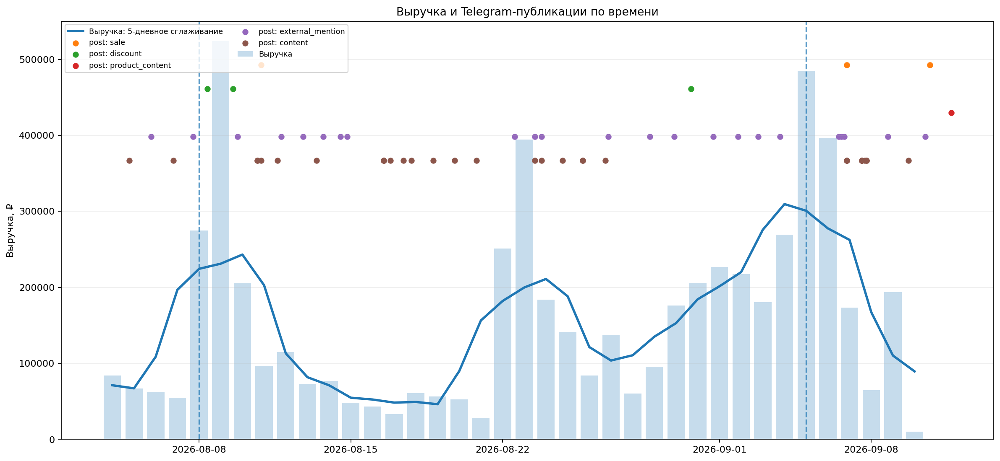
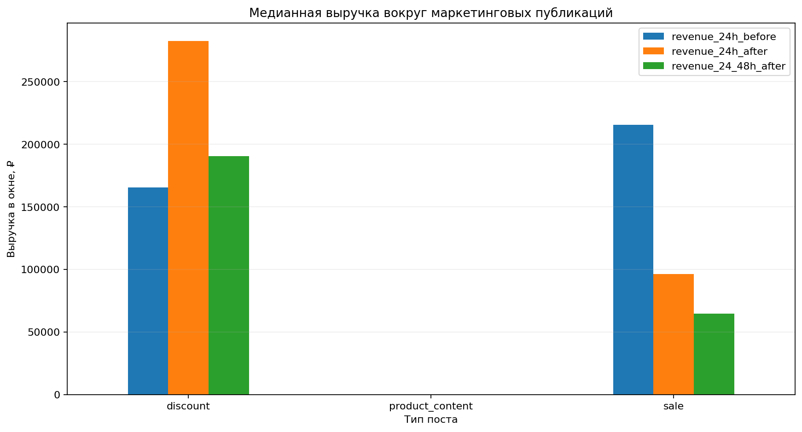
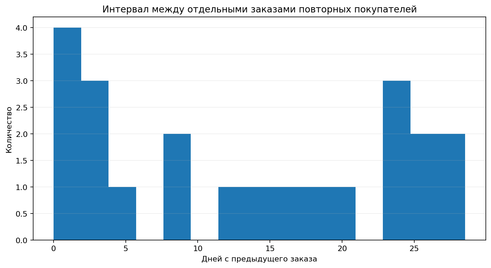

# EDA: продажи и Telegram-публикации

Ноутбук `EDA.ipynb` содержит разведочный анализ исторических данных проекта: продаж и публикаций собственного Telegram-канала.

Цель EDA — понять структуру продаж, исследовать динамику спроса и посмотреть, как покупки располагаются во времени относительно Telegram-публикаций. Исторические данные не содержат связи `пост → пользователь → покупка`, поэтому временные совпадения здесь рассматриваются как **ассоциация, а не причинный эффект**.

## Продажи

Исходная таблица содержит **795 строк продуктов**, но строка не всегда соответствует отдельной покупке. Несколько курсов одного студента с одинаковым timestamp считаются одним bundle-заказом.

После агрегации на уровень заказа:

| Метрика | Значение |
|---|---:|
| Строк продуктов | 795 |
| Заказов | 628 |
| Уникальных покупателей | 606 |
| Продуктов | 18 |
| Выручка | ≈ 5,90 млн ₽ |
| Средний чек заказа | ≈ 9,40 тыс. ₽ |
| Медианный чек заказа | 8,95 тыс. ₽ |
| Bundle-заказов | 153 |
| Повторных покупателей | 20 |
| Доля повторных покупателей | 3,30% |

Такой расчет исправляет ошибку предыдущей версии EDA, где несколько строк внутри одного bundle могли интерпретироваться как повторные покупки.

### Продукты и выручка

Ноутбук отдельно анализирует выручку по продуктам.

## Динамика спроса

Для каждого дня рассчитываются выручка, количество заказов и покупателей. Чтобы лучше видеть общий паттерн спроса, используется 5-дневное сглаживание.

На графике также отмечаются известные календарные события, совпадающие с периодами изменения спроса.

Доступная история продаж охватывает только период **04.08.2026–10.09.2026**, поэтому по ней нельзя надежно оценить годовую сезонность. Здесь корректнее говорить о **календарной динамике спроса внутри доступного периода**.

## Telegram-публикации

Для периода продаж загружаются публикации собственного Telegram-канала и классифицируются rule-based алгоритмом по тексту.

Используются категории:

| Категория | Смысл |
|---|---|
| `content` | обычный информационный контент |
| `product_content` | контент с упоминанием продукта |
| `sale` | публикация с продажным / наборным контекстом |
| `discount` | скидка, акция или промокод |
| `external_mention` | упоминание внешней компании в релевантном контексте |

`external_mention` **не означает подтвержденное платное рекламное размещение**. Это только результат классификации текста публикации собственного канала.

## Продажи и Telegram-посты

Продажи и публикации совмещаются по времени: на одной шкале показаны дневная выручка, ее сглаженная динамика и timestamps Telegram-постов разных типов.

График помогает увидеть, какие публикации выходили рядом со всплесками продаж. Однако такое совпадение само по себе не доказывает, что публикация вызвала покупку: на спрос одновременно могут влиять внешние события, календарный фактор и другие коммуникации.

## Продажи вокруг маркетинговых публикаций

Дополнительно используется описательный event-study. Для маркетинговых публикаций сравнивается выручка в фиксированных временных окнах:

- 24 часа до публикации;
- 24 часа после публикации;
- 24–48 часов после публикации.

Этот анализ показывает **temporal association**, но не incremental lift. Окна разных публикаций могут пересекаться, а сами публикации могут планироваться на периоды ожидаемого спроса.

## Повторные покупки

Repeat purchase рассчитывается только после перехода на уровень заказа. Несколько курсов, купленных одним студентом одновременно, считаются одним bundle-заказом.

В текущей истории отдельный повторный заказ совершили **20 из 606 покупателей (3,30%)**.

## Вывод

Исторические данные позволяют измерить выручку, заказы, продуктовый микс, bundle-заказы, повторные покупки и временную динамику спроса. Telegram export позволяет восстановить даты и содержание публикаций собственного канала и сопоставить их с продажами по времени.

При этом исторически отсутствует ключевая user-level связь:

`placement → user → touch → lead → order`

Поэтому из EDA нельзя надежно восстановить historical attribution ROMI или incremental effect рекламы. Этот пробел закрывает measurement-flow Telegram-бота: для новых кампаний система начинает собирать источник, placement и пользовательские касания до покупки.
